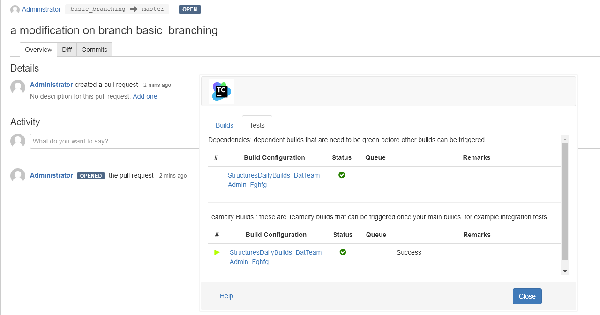
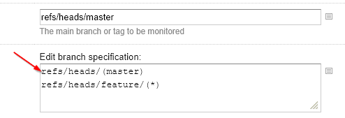
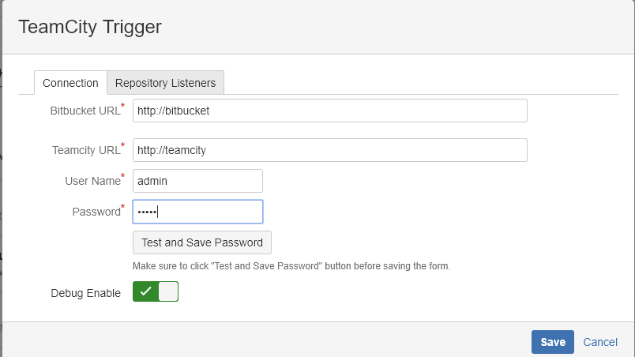
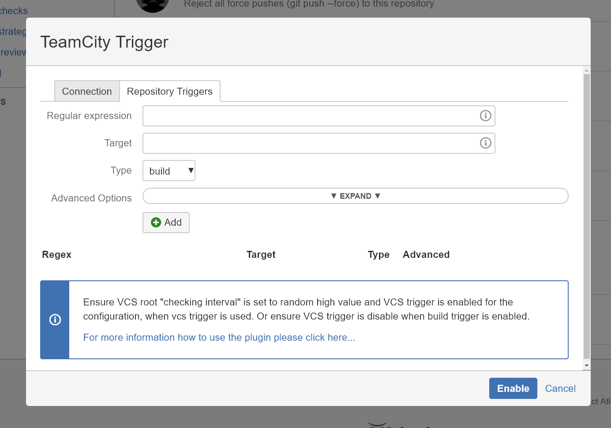
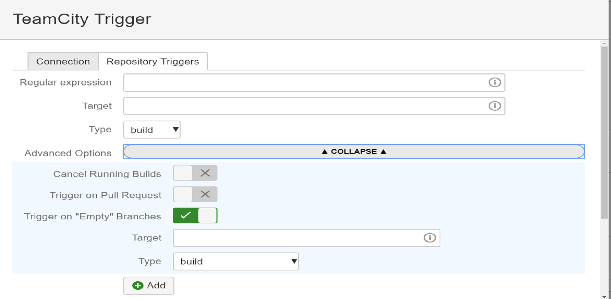

# Bitbucket Server Hook to trigger TeamCity builds

Req: Min TeamCity 8.x, BitbucketServer 5.x
Download last release from MarketPlace [MarketPlace!](https://marketplace.atlassian.com/plugins/com.trimble.tekla/server/overview) 

# Features
   The plugin works in 2 different ways, the default will request a VCS root to check for changes. In this case, all build configurations that use the VCS root will be triggered. 
   
   The second method provides more control and it will trigger only the selected build configurations and selected branch. This is the default.
   
   
   
   It adds a "build and test" menu to pull request so user can extend their own workflows with remote triggers of tests and remote triggers of build systems. Additionally provides information about:
   * time to start build, if found in queue
   * manual trigger build
   * detection of invalid conditions for the pull request, for example if TeamCity has crashed the hook will warn if TeamCity has not build the last commit in the branch.
   * links directly to the builds 
   * information about steps running and error failures and complete percentage

# TeamCity Configuration
   * Create a vcs root and set the checking interval to a random high value to improve performance.
   * If you use build trigger, disable all vcs triggers in TeamCity.      
   * Save the VCS root id to be use in bitbucket configuration if you use VCS configuration
   * Ensure default branch is also part of the branch specicication, so that the branch is displayed instead of `<default>`
   
   

## Branch capture considerations
In TeamCity, when using captures `()` TeamCity will display only the catpured value inside. So when defining regular expressions be sure the same approach is followed in Bitbucket side. For example in TeamCity

     +:refs/heads/feature/(*)
     +:refs/heads/bugfix/(*)
You can use RegEx

     feature/(.)
     bugfix/(.)
     
### Default branch
In case you use only default branch in teamcity, for example refs/heads/master the reg expression in teamcity will need to capture the all (refs/heads/master). This is supported only for Teamcity 2017 and above. Triggering default branch in previous versions is deprecated.
     
# Bitbucket configuration

## Connection Settings

   
   * set servers address, username and password. press test and save connection   
   * set one of the VCS roots to the value retrieved in previous section   
   * enable debug mode

### Debug
Check the catalina log for logs error messages like:

   * [TeamCityTriggerHook] Trigger builds for branch: feature-a
   * [TeamCityTriggerHook] Trigger BuildId: BuildConfigId
   * [TeamCityTriggerHook] Trigger BuildId: BuildConfigId2

## Listeners Configuration
  

### Basic Configuration
  
  
  Create basic listeners that trigger TeamCity builds:
  * RegEx: Regular expression to match and to capture branch to trigger. Make sure default branch is part of branch definition in TeamCity  
  * Target: Either build configuration ID or VCS root Id. If build id is selected on Type then the hook will trigger manually builds, otherwise it will ask TeamCity to check for changes. build type reacts immediately.  
  * Type: either build or vcs. see Target in previous bullet

### Advanced Configuration
  
  
  Provides additional options to control the builds (applies only to Type: Build)
  * Cancel Running Builds: User typically pushes multiple commits, for example if running builds in feature branch, you might not need TeamCity to build all commits. Enable this option to cancel all running builds and add a new one to queue.
  * Trigger on Pull Request: This ensures that only after a pull request is created then the build is triggered. You could achieve a similar behavior by triggering defining branch specification for pr/* however this brings the display of these branches in TeamCity side and its not easy to track to what branch the pr belongs 2. pr\/* are not found in the Bitbucket ui, so it sounds good not to use these branch defintions in TeamCity either.

#### Enabling Test builds and External triggers
   The hook provides the possibility to trigger tests and other build configurations when build dependencies are met. Something like build chains in TeamCity, but the hook controls when things can be triggered.
   * Target: this is the build that user will be able to trigger once Target in Basic configuration is green
   * Type: build, rest, or newtab
      1. rest and newtab: will create a external build tabs in the build and test menu. A button per hook will be created so user can trigger. NewTab will open a new tab with the defined target.
      2. build: is a teamcity build id and will enable tests tab in build and test menu.

